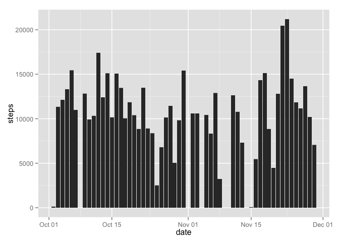
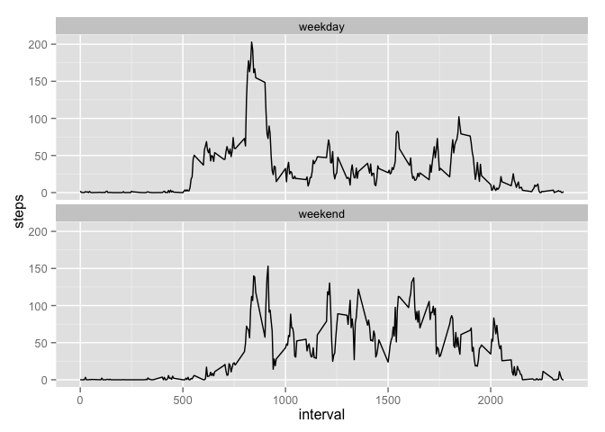

# Reproducible Research: Peer Assessment 1

I will use `ggplot2` for all graphs

```r
library(ggplot2)
```

## Loading and preprocessing the data

Read the data from the file `activity.csv` and convert the 2nd column to the Date format

```r
data <- read.csv("activity.csv")
data[,2] <- as.Date(data[,2], "%Y-%m-%d")
```

## What is mean total number of steps taken per day?

### Draw a histogram of the total number of steps taken each day

```r
ggplot(na.omit(data), aes(x=date, y=steps)) + geom_bar(stat='identity')
```

 

### Count the **mean** and **median** for total number of steps taken per day

```r
mean <- with(data, aggregate(steps, list(date), mean, na.rm = TRUE))
names(mean) <- c("date", "mean")
median <- with(data, aggregate(steps, list(date), median, na.rm = TRUE))
names(median) <- c("date", "median")
mean_median <- merge(mean, median)
mean_median
```

```
##          date       mean median
## 1  2012-10-01        NaN     NA
## 2  2012-10-02  0.4375000      0
## 3  2012-10-03 39.4166667      0
## 4  2012-10-04 42.0694444      0
## 5  2012-10-05 46.1597222      0
## 6  2012-10-06 53.5416667      0
## 7  2012-10-07 38.2465278      0
## 8  2012-10-08        NaN     NA
## 9  2012-10-09 44.4826389      0
## 10 2012-10-10 34.3750000      0
## 11 2012-10-11 35.7777778      0
## 12 2012-10-12 60.3541667      0
## 13 2012-10-13 43.1458333      0
## 14 2012-10-14 52.4236111      0
## 15 2012-10-15 35.2048611      0
## 16 2012-10-16 52.3750000      0
## 17 2012-10-17 46.7083333      0
## 18 2012-10-18 34.9166667      0
## 19 2012-10-19 41.0729167      0
## 20 2012-10-20 36.0937500      0
## 21 2012-10-21 30.6284722      0
## 22 2012-10-22 46.7361111      0
## 23 2012-10-23 30.9652778      0
## 24 2012-10-24 29.0104167      0
## 25 2012-10-25  8.6527778      0
## 26 2012-10-26 23.5347222      0
## 27 2012-10-27 35.1354167      0
## 28 2012-10-28 39.7847222      0
## 29 2012-10-29 17.4236111      0
## 30 2012-10-30 34.0937500      0
## 31 2012-10-31 53.5208333      0
## 32 2012-11-01        NaN     NA
## 33 2012-11-02 36.8055556      0
## 34 2012-11-03 36.7048611      0
## 35 2012-11-04        NaN     NA
## 36 2012-11-05 36.2465278      0
## 37 2012-11-06 28.9375000      0
## 38 2012-11-07 44.7326389      0
## 39 2012-11-08 11.1770833      0
## 40 2012-11-09        NaN     NA
## 41 2012-11-10        NaN     NA
## 42 2012-11-11 43.7777778      0
## 43 2012-11-12 37.3784722      0
## 44 2012-11-13 25.4722222      0
## 45 2012-11-14        NaN     NA
## 46 2012-11-15  0.1423611      0
## 47 2012-11-16 18.8923611      0
## 48 2012-11-17 49.7881944      0
## 49 2012-11-18 52.4652778      0
## 50 2012-11-19 30.6979167      0
## 51 2012-11-20 15.5277778      0
## 52 2012-11-21 44.3993056      0
## 53 2012-11-22 70.9270833      0
## 54 2012-11-23 73.5902778      0
## 55 2012-11-24 50.2708333      0
## 56 2012-11-25 41.0902778      0
## 57 2012-11-26 38.7569444      0
## 58 2012-11-27 47.3819444      0
## 59 2012-11-28 35.3576389      0
## 60 2012-11-29 24.4687500      0
## 61 2012-11-30        NaN     NA
```

## What is the average daily activity pattern?

### Create a dataset  the average number of steps taken across all days on each 5 min interval

```r
average <- with(data, aggregate(steps, list(interval), mean, na.rm = TRUE))
names(average) <- c("interval", "steps")
```

### The time series plot the 5-minute interval and the average number of steps taken across all days

```r
ggplot(na.omit(data), aes(x=interval, y=steps)) + stat_summary(fun.y="mean", geom="line")
```

 

### 5-minute interval that contains the maximum number of steps on average across all the days

```r
average[which.max(average[,2]),]
```

```
##     interval    steps
## 104      835 206.1698
```
The interval 835 has the maximum amount of step

## Imputing missing values

### The total number of missing values in the dataset

```r
summary(is.na(data))
```

```
##    steps            date          interval      
##  Mode :logical   Mode :logical   Mode :logical  
##  FALSE:15264     FALSE:17568     FALSE:17568    
##  TRUE :2304      NA's :0         NA's :0        
##  NA's :0
```
The total number of rows with NA is 2304

### Prepare to re-use the data frame mean to re-fill the values

```r
data_without_na <- data
mean[is.na(mean[,2]), 2] <- 0
```

### Replace NA in the dataset with average per day

```r
for (i in 1:length(data_without_na[ ,1])) {
    if (is.na(data_without_na[i, 1])) {
        data_without_na[i, 1] <- mean[mean$date == data_without_na[i, 2], 2]
    }
}
```

### Re-draw a histogram of the total number of steps taken each day without NA

```r
ggplot(data_without_na, aes(x=date, y=steps)) + geom_bar(stat='identity')
```

 

### Re-count the **mean** and **median** for total number of steps taken per day without NA

```r
imputed_mean <- with(data_without_na, aggregate(steps, list(date), mean, na.rm = TRUE))
names(imputed_mean) <- c("date", "imputed mean")
imputed_median <- with(data_without_na, aggregate(steps, list(date), median, na.rm = TRUE))
names(imputed_median) <- c("date", "imputed median")
imputed_mean_median <- merge(imputed_mean, imputed_median)
imputed_mean_median
```

```
##          date imputed mean imputed median
## 1  2012-10-01    0.0000000              0
## 2  2012-10-02    0.4375000              0
## 3  2012-10-03   39.4166667              0
## 4  2012-10-04   42.0694444              0
## 5  2012-10-05   46.1597222              0
## 6  2012-10-06   53.5416667              0
## 7  2012-10-07   38.2465278              0
## 8  2012-10-08    0.0000000              0
## 9  2012-10-09   44.4826389              0
## 10 2012-10-10   34.3750000              0
## 11 2012-10-11   35.7777778              0
## 12 2012-10-12   60.3541667              0
## 13 2012-10-13   43.1458333              0
## 14 2012-10-14   52.4236111              0
## 15 2012-10-15   35.2048611              0
## 16 2012-10-16   52.3750000              0
## 17 2012-10-17   46.7083333              0
## 18 2012-10-18   34.9166667              0
## 19 2012-10-19   41.0729167              0
## 20 2012-10-20   36.0937500              0
## 21 2012-10-21   30.6284722              0
## 22 2012-10-22   46.7361111              0
## 23 2012-10-23   30.9652778              0
## 24 2012-10-24   29.0104167              0
## 25 2012-10-25    8.6527778              0
## 26 2012-10-26   23.5347222              0
## 27 2012-10-27   35.1354167              0
## 28 2012-10-28   39.7847222              0
## 29 2012-10-29   17.4236111              0
## 30 2012-10-30   34.0937500              0
## 31 2012-10-31   53.5208333              0
## 32 2012-11-01    0.0000000              0
## 33 2012-11-02   36.8055556              0
## 34 2012-11-03   36.7048611              0
## 35 2012-11-04    0.0000000              0
## 36 2012-11-05   36.2465278              0
## 37 2012-11-06   28.9375000              0
## 38 2012-11-07   44.7326389              0
## 39 2012-11-08   11.1770833              0
## 40 2012-11-09    0.0000000              0
## 41 2012-11-10    0.0000000              0
## 42 2012-11-11   43.7777778              0
## 43 2012-11-12   37.3784722              0
## 44 2012-11-13   25.4722222              0
## 45 2012-11-14    0.0000000              0
## 46 2012-11-15    0.1423611              0
## 47 2012-11-16   18.8923611              0
## 48 2012-11-17   49.7881944              0
## 49 2012-11-18   52.4652778              0
## 50 2012-11-19   30.6979167              0
## 51 2012-11-20   15.5277778              0
## 52 2012-11-21   44.3993056              0
## 53 2012-11-22   70.9270833              0
## 54 2012-11-23   73.5902778              0
## 55 2012-11-24   50.2708333              0
## 56 2012-11-25   41.0902778              0
## 57 2012-11-26   38.7569444              0
## 58 2012-11-27   47.3819444              0
## 59 2012-11-28   35.3576389              0
## 60 2012-11-29   24.4687500              0
## 61 2012-11-30    0.0000000              0
```

### Compare mean and median before and after the imputing

```r
compare_mean_median <- merge(mean_median, imputed_mean_median)
compare_mean_median <- compare_mean_median[,c(1, 2, 4, 3, 5)]
compare_mean_median
```

```
##          date       mean imputed mean median imputed median
## 1  2012-10-01        NaN    0.0000000     NA              0
## 2  2012-10-02  0.4375000    0.4375000      0              0
## 3  2012-10-03 39.4166667   39.4166667      0              0
## 4  2012-10-04 42.0694444   42.0694444      0              0
## 5  2012-10-05 46.1597222   46.1597222      0              0
## 6  2012-10-06 53.5416667   53.5416667      0              0
## 7  2012-10-07 38.2465278   38.2465278      0              0
## 8  2012-10-08        NaN    0.0000000     NA              0
## 9  2012-10-09 44.4826389   44.4826389      0              0
## 10 2012-10-10 34.3750000   34.3750000      0              0
## 11 2012-10-11 35.7777778   35.7777778      0              0
## 12 2012-10-12 60.3541667   60.3541667      0              0
## 13 2012-10-13 43.1458333   43.1458333      0              0
## 14 2012-10-14 52.4236111   52.4236111      0              0
## 15 2012-10-15 35.2048611   35.2048611      0              0
## 16 2012-10-16 52.3750000   52.3750000      0              0
## 17 2012-10-17 46.7083333   46.7083333      0              0
## 18 2012-10-18 34.9166667   34.9166667      0              0
## 19 2012-10-19 41.0729167   41.0729167      0              0
## 20 2012-10-20 36.0937500   36.0937500      0              0
## 21 2012-10-21 30.6284722   30.6284722      0              0
## 22 2012-10-22 46.7361111   46.7361111      0              0
## 23 2012-10-23 30.9652778   30.9652778      0              0
## 24 2012-10-24 29.0104167   29.0104167      0              0
## 25 2012-10-25  8.6527778    8.6527778      0              0
## 26 2012-10-26 23.5347222   23.5347222      0              0
## 27 2012-10-27 35.1354167   35.1354167      0              0
## 28 2012-10-28 39.7847222   39.7847222      0              0
## 29 2012-10-29 17.4236111   17.4236111      0              0
## 30 2012-10-30 34.0937500   34.0937500      0              0
## 31 2012-10-31 53.5208333   53.5208333      0              0
## 32 2012-11-01        NaN    0.0000000     NA              0
## 33 2012-11-02 36.8055556   36.8055556      0              0
## 34 2012-11-03 36.7048611   36.7048611      0              0
## 35 2012-11-04        NaN    0.0000000     NA              0
## 36 2012-11-05 36.2465278   36.2465278      0              0
## 37 2012-11-06 28.9375000   28.9375000      0              0
## 38 2012-11-07 44.7326389   44.7326389      0              0
## 39 2012-11-08 11.1770833   11.1770833      0              0
## 40 2012-11-09        NaN    0.0000000     NA              0
## 41 2012-11-10        NaN    0.0000000     NA              0
## 42 2012-11-11 43.7777778   43.7777778      0              0
## 43 2012-11-12 37.3784722   37.3784722      0              0
## 44 2012-11-13 25.4722222   25.4722222      0              0
## 45 2012-11-14        NaN    0.0000000     NA              0
## 46 2012-11-15  0.1423611    0.1423611      0              0
## 47 2012-11-16 18.8923611   18.8923611      0              0
## 48 2012-11-17 49.7881944   49.7881944      0              0
## 49 2012-11-18 52.4652778   52.4652778      0              0
## 50 2012-11-19 30.6979167   30.6979167      0              0
## 51 2012-11-20 15.5277778   15.5277778      0              0
## 52 2012-11-21 44.3993056   44.3993056      0              0
## 53 2012-11-22 70.9270833   70.9270833      0              0
## 54 2012-11-23 73.5902778   73.5902778      0              0
## 55 2012-11-24 50.2708333   50.2708333      0              0
## 56 2012-11-25 41.0902778   41.0902778      0              0
## 57 2012-11-26 38.7569444   38.7569444      0              0
## 58 2012-11-27 47.3819444   47.3819444      0              0
## 59 2012-11-28 35.3576389   35.3576389      0              0
## 60 2012-11-29 24.4687500   24.4687500      0              0
## 61 2012-11-30        NaN    0.0000000     NA              0
```

The imputing the dataset has no impact on the results because NA in the dataset exists only for the whole day

## Are there differences in activity patterns between weekdays and weekends?

### Add a factor variable indicating whether a given date is a weekday or weekend day

```r
data_without_na$day <- "weekday"
data_without_na[weekdays(data_without_na$date) == "Saturday" | weekdays(data_without_na$date) == "Sunday", "day"] <- "weekend"
data_without_na$day <- as.factor(data_without_na$day)
```

### Make a panel plot of the 5-minute interval and the average number of steps taken averaged across all weekday days or weekend days

```r
ggplot(data_without_na, aes(x=interval, y=steps)) + facet_wrap(~ day, nrow = 2) + stat_summary(fun.y="mean", geom="line")
```

 
